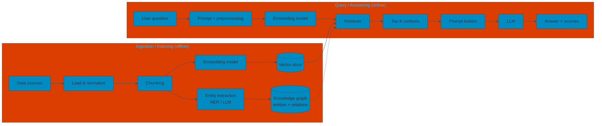
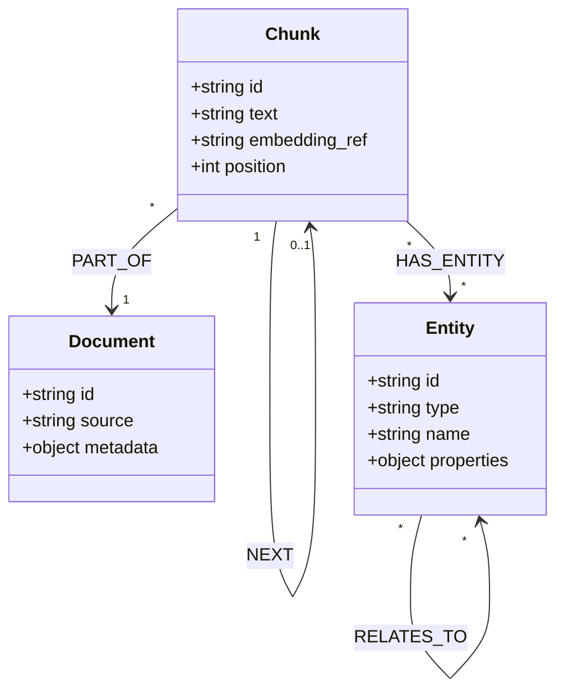
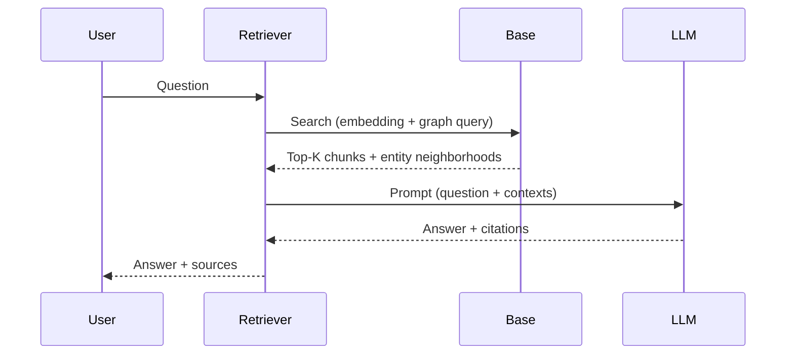

# Graph RAG with Entities

After chunking, we extract **entities** and **relationships** from the text and store them in a graph. Retrieval can then use both embeddings (lexical) and the graph (structural).

---

### Database After Ingestion

After ingestion you have:

- **Chunks**: text passages + optional embedding reference and source metadata.
- **Entities**: nodes with an identifier, type (or label), name, and optional properties.
- **Relations**: directed edges between entities (type, source, target).
- **Chunk–entity links**: which chunks mention which entities (e.g. `MENTIONS`), so retrieval can go from text to graph and back.

The following class diagram summarizes the **conceptual model** of what is stored: three node types (**Document**, **Chunk**, **Entity**) and four relation types.

- **Document**: source unit (file, URL, etc.); chunks are part of it via **PART_OF**.
- **Chunk**: unstructured passage; **PART_OF** a document, **NEXT** links to the following chunk in order, **HAS_ENTITY** links to entities mentioned in the chunk.
- **Entity**: structured node; **RELATES_TO** links entities to each other (e.g. Person—WORKS_AT—Organization). `type` and `properties` are constrained in a strict schema, open in a free schema.

---

## Retrieval flow (sequence)

At query time, the **user** sends a question; the **retriever** queries the **base** (vector store + graph), then the **LLM** produces an answer from the retrieved context.

