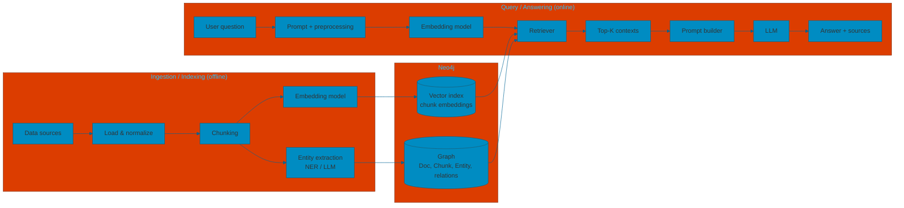
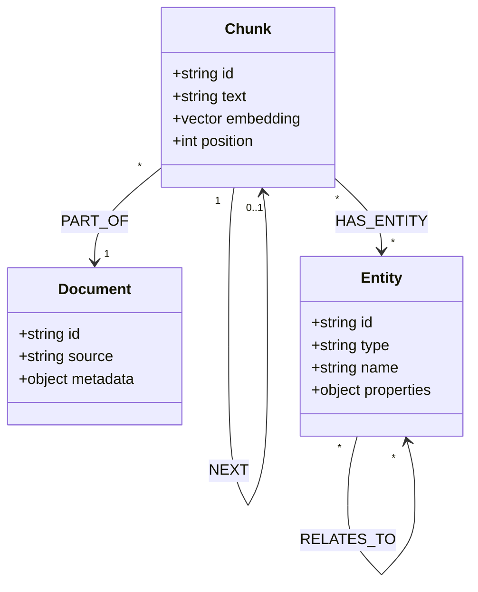
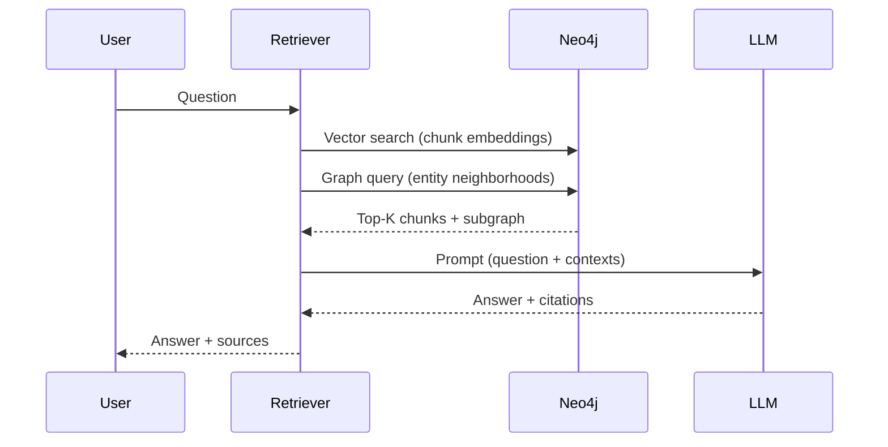

# Graph RAG with Entities

After chunking, we extract **entities** and **relationships** from the text and store everything in **Neo4j**: the graph (Document, Chunk, Entity, relations) and the chunk embeddings (vector index in Neo4j). Retrieval uses both vector similarity search and graph traversal in the same base.

---

### Database After Ingestion

Everything lives in **Neo4j**:

- **Chunks**: nodes with text, position, and **embedding** (stored in a Neo4j vector index for similarity search).
- **Documents** and **Entities**: nodes with identifiers, types, and properties.
- **Relations**: PART_OF, NEXT, HAS_ENTITY, RELATES_TO (graph edges in Neo4j).
- **Vector index**: on chunk embeddings, so semantic search and graph queries run in the same store.

The following class diagram summarizes the **conceptual model** of what is stored: three node types (**Document**, **Chunk**, **Entity**) and four relation types.

- **Document**: source unit (file, URL, etc.); chunks are part of it via **PART_OF**.
- **Chunk**: unstructured passage; **PART_OF** a document, **NEXT** for order, **HAS_ENTITY** to entities; `embedding` is stored in Neo4j and indexed for vector search.
- **Entity**: structured node; **RELATES_TO** links entities to each other (e.g. Person—WORKS_AT—Organization). `type` and `properties` are constrained in a strict schema, open in a free schema.

---

## Retrieval flow (sequence)

At query time the **retriever** queries **Neo4j** only: vector search on the chunk index and graph queries (entity neighborhoods). The LLM then gets the merged context.

