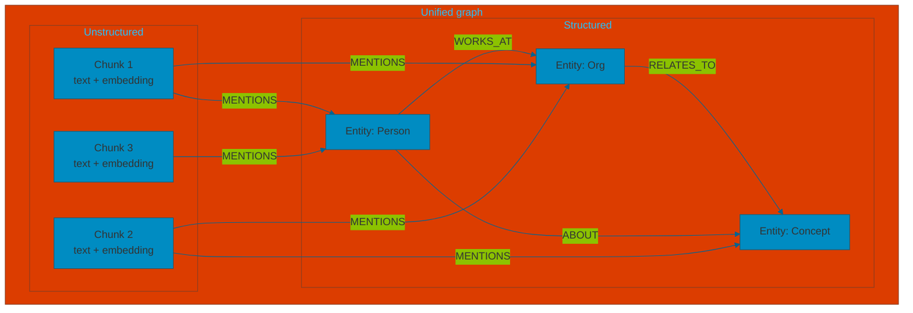

# Unified graph model

The **unified graph** is a single store that holds **both structured and unstructured data**, linked together so retrieval can use lexical search (over text/embeddings) and graph traversal (over entities and relations) in one place.

- **Structured data**: entities (typed nodes), relationships (typed edges), schema (e.g. Person, Organization, WORKS_AT).
- **Unstructured data**: text chunks (raw passages), optionally with embeddings attached to chunk nodes.
- **Links**: chunks are connected to entities they mention (e.g. `Chunk --MENTIONS--> Entity`); entities are connected to each other by relations. So the same graph contains passages and the knowledge graph, and we can traverse from a chunk to its entities or from an entity to its chunks.

**Why both?**

| Data | Role |
|------|------|
| **Unstructured (chunks)** | Lexical / semantic search (vector similarity), full text for citations and context. |
| **Structured (entities + relations)** | Domain logic, multi-hop reasoning, entity-centric retrieval. |
| **Chunk–entity links** | From a retrieved chunk, follow to related entities; from a matched entity, gather all chunks that mention it. |

One graph, one store: structured and unstructured nodes plus the edges between them.
