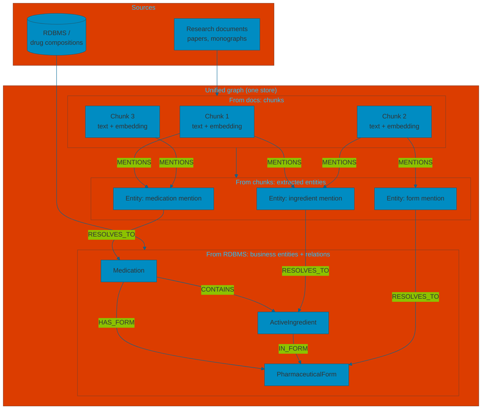
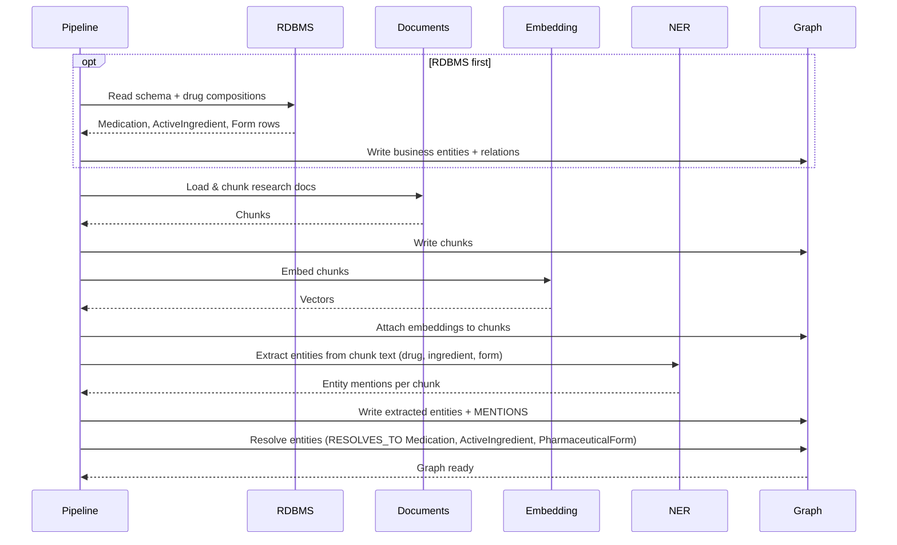
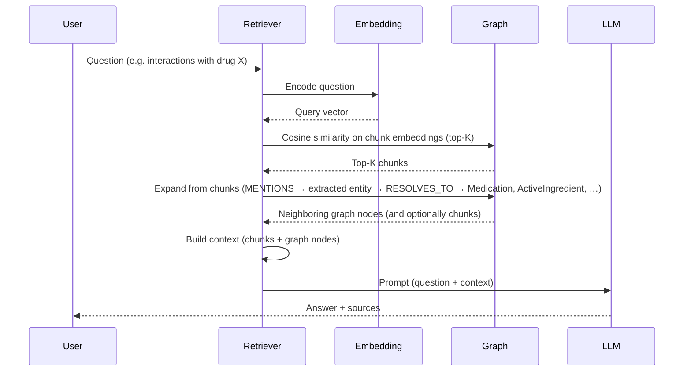
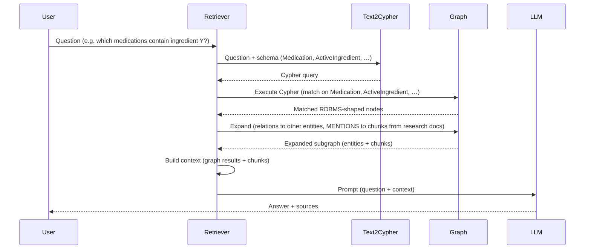

# Unified graph model

This page illustrates the unified graph with a **pharmaceutical use case**: a base of **drug compositions** (medications, active ingredients, forms) in an RDBMS, and **research documents** (papers, monographs). The graph unifies both so retrieval can combine structured drug data and unstructured literature.

---

## What “structured” means here

The term **structured data** is ambiguous. In data engineering it usually refers to **relational (RDBMS) data** (tables, rows, keys). In knowledge graphs and GenAI it often means **semantically structured** data—entities and relationships—as opposed to raw text. Here we use *structured* in the first sense: data that already lives in a database (e.g. drug compositions, ingredients), which we ingest into the graph as **business entities** and relations.

---

## Definition

**Unified graph model** means a **single store** that holds:

- **Relational data** ingested from RDBMS: e.g. medications, active ingredients, pharmaceutical forms, compositions—mapped into the graph as business entities and typed relationships.
- **Unstructured documents**: e.g. research papers, clinical documents—chunked into passages (chunks) with optional embeddings.

Everything lives in one **semantic graph**, with **explicit links** between chunks and business entities (e.g. a chunk from a paper mentions a drug that also exists as a Medication node from the DB). Retrieval can then combine vector search over chunks, graph traversal over entities and relations, and follow links from chunks to entities or the reverse.

---

## Conceptual view (pharma example)

RDBMS (drug database) is often imported **before** research documents so that entities extracted from chunks can be resolved to existing medications and ingredients. The diagram shows: (1) nodes from RDBMS with labels **Medication**, **ActiveIngredient**, **PharmaceuticalForm**; (2) chunks from research docs and **entities extracted from chunks**; (3) a relation from those extracted entities to the RDBMS-derived nodes.

- **From RDBMS**: **Medication**, **ActiveIngredient**, **PharmaceuticalForm** and relations (e.g. CONTAINS, HAS_FORM, IN_FORM).
- **From documents**: **chunks** (research text + optional embeddings).
- **From chunks**: **entities extracted** from text (medication/ingredient/form mentions).
- **Chunk → MENTIONS → extracted entity** then **RESOLVES_TO → Medication | ActiveIngredient | PharmaceuticalForm**: so retrieval can join literature context and drug data.

---

## Why unify?

| Data | Role |
|------|------|
| **Unstructured (chunks)** | Lexical / semantic search over research text, full passages for citations and context. |
| **Relational → entities + relations** | Drug compositions, multi-hop reasoning (e.g. medication → ingredients → forms), alignment with the drug database. |
| **Chunk–entity links** | From a retrieved chunk, follow to related medications/ingredients; from a matched medication, gather all chunks that mention it. |

One graph, one store: drug data (as entities/relations), research chunks, and explicit links between them.

---

## Ingestion (sequence diagram)

Ingestion runs with the drug RDBMS loaded first, then research documents; entities extracted from chunks are resolved to Medication, ActiveIngredient, PharmaceuticalForm.

- **RDBMS first (opt)**: load drug compositions into the graph as Medication, ActiveIngredient, PharmaceuticalForm and relations.
- **Documents**: load and chunk research papers; write chunks into the graph.
- **Embedding** / **NER** / **Resolve**: same as before, with pharma entity types.

---

## Retrieval

Two retrieval strategies can be used (alone or combined): **embedding-first** (cosine similarity on chunks then graph expand) and **text2cypher** (natural language → Cypher on the RDBMS-shaped schema, then expand to bring back related entities and chunks). Both feed a single context to the LLM.

### 1. Embedding-first retrieval

The user question is converted into an embedding; we run **cosine similarity** over chunk embeddings to get top-K chunks, then **expand** on the graph (follow MENTIONS and RESOLVES_TO to reach Medication, ActiveIngredient, etc.) and add those nodes (and optionally neighboring chunks) to the context.

- **Cosine similarity** selects the most relevant research chunks.
- **Expand** pulls in related medications, ingredients, and forms (and optionally more chunks) so the LLM sees both text and structured drug data.

### 2. Text2Cypher retrieval

A **text2cypher** agent turns the natural-language question into a Cypher query that **matches the RDBMS-derived schema** (Medication, ActiveIngredient, PharmaceuticalForm). The query is run on the graph; we then **expand** from the matched nodes (e.g. follow relations to other entities and to chunks that MENTION them) and add the result to the context for the LLM.

- **Text2Cypher** aligns the question with the drug DB schema and produces Cypher that targets Medication, ActiveIngredient, PharmaceuticalForm (and their relations).
- **Expand** brings back related entities and **chunks from research documents** linked via MENTIONS, so the LLM gets both structured composition data and relevant literature in the same context.

Neo4j has a full example able to achieve this : https://github.com/neo4j-field/pubmed-knowledge-graph-generation 