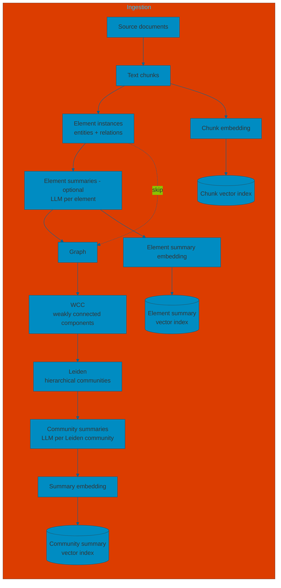
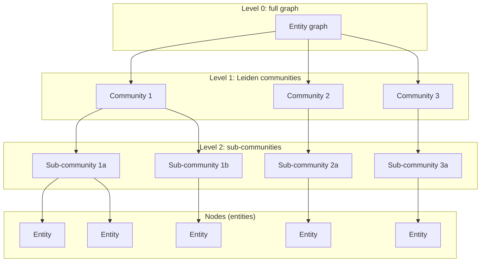
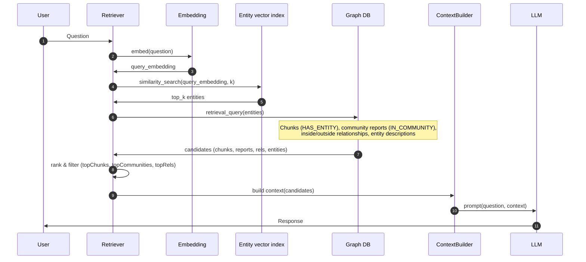
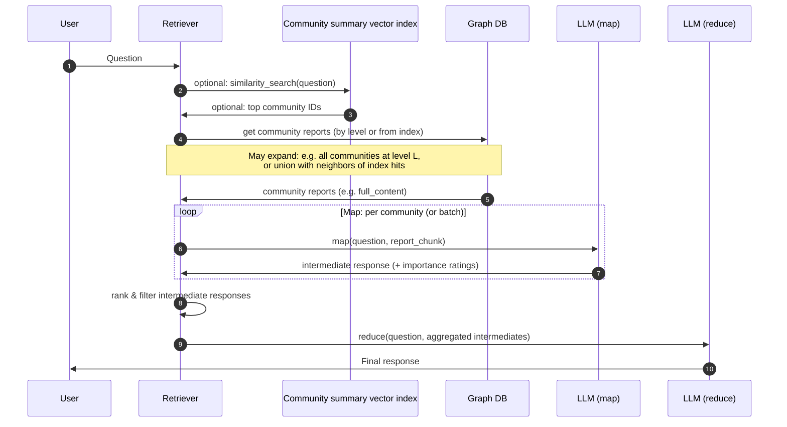

# Hierarchical graph RAG

Hierarchical graph RAG adds a **community** layer on top of the entity graph: the graph is partitioned into **communities** (e.g. via WCC then **Leiden**), and each Leiden community gets a **summary** generated by an LLM. At query time, retrieval can use not only chunks and entity neighborhoods but also these **community summaries** to provide high-level, topical context.

**Community summaries are only as good as the communities themselves, and community quality directly depends on accurate entity resolution and well-defined relationships.**

---

## Pipeline overview (ingestion)

- **Element summaries (optional)**: The pipeline can build the graph directly from element instances (C → E). When **element summarization** is enabled, an LLM generates a description per entity (and optionally per relationship) before graph construction (C → D → E). When present, these summaries enrich the graph and can be used for entity-centric retrieval; they are **vectorized** and stored in a dedicated **element summary vector index** (see below).
- **Chunk vector index**: After chunking, each text chunk is embedded (e.g. with the same embedding model used at query time). A **dedicated vector index** is built over chunk embeddings so that local retrieval (or hybrid retrieval) can quickly find semantically relevant chunks. Index options typically include dimension, similarity function (e.g. cosine), and optional metadata filters.
- **Element summary vector index**: When element summarization is used, each element summary (e.g. entity or relationship description) is embedded and stored in a **separate** vector index. This index supports **local retrieval** by finding relevant entities (or relationships) via similarity search before expanding to chunks, community reports, and relationships in the graph.
- **Community summary vector index**: After community summarization, each community’s summary (e.g. title, short summary, or full report) is embedded and stored in a **separate** vector index. This index is used primarily for **global retrieval** to quickly find which communities are relevant to a query before optionally expanding (e.g. by hierarchy level) and running map-reduce over their reports. Keeping it separate from the chunk index avoids mixing granularities and allows different indexing or ranking strategies for summaries vs. raw chunks.

---

## Role of WCC (Weakly Connected Components)

**WCC** finds **weakly connected components** in the graph: maximal sets of nodes that are connected when edge direction is ignored. In the ingestion pipeline, WCC is used **before** Leiden for one or more of the following:

- **Identify disconnected subgraphs**: The entity graph may have several separate “islands” (e.g. different document clusters with no shared entities). WCC labels each node with its component ID so you know which nodes belong to the same connected region.
- **Run Leiden per component (optional)**: You can run Leiden separately on each WCC component instead of on the whole graph. That avoids treating the entire graph as one big component and can make community detection more meaningful and efficient.
- **Filter or skip tiny components**: Very small components (e.g. single nodes or pairs) may be noise; you can skip them or handle them differently before or after Leiden.

So in the pipeline, **WCC** answers “which nodes are in the same connected piece of the graph?”; **Leiden** then answers “within each (optionally per-component) graph, how do we partition nodes into hierarchical communities?”.

---

## Leiden

**Leiden** is a hierarchical community detection algorithm: it recursively clusters nodes by optimizing modularity, then condenses the graph and repeats, producing a hierarchy of communities. Two parameters are especially relevant for Graph RAG:

### includeIntermediateCommunities

- **Type**: Boolean (default: `false`).
- **Meaning**: When `true`, the algorithm **persists community IDs at every level** of the hierarchy, not only the final level. In stream mode, each node gets an `intermediateCommunityIds` list (e.g. `[level0Id, level1Id, level2Id]`); in write/mutate mode, you can write one property per level.
- **Use in Graph RAG**: Set to `true` if you want **multi-level** community structure (e.g. coarse themes at level 1, finer topics at level 2). Retrieval can then use the level that best matches query granularity. If you only need a flat partition, leave it `false` and use only the final community ID.

### relationshipWeightProperty

- **Type**: String (default: `null`).
- **Meaning**: Name of the **relationship property** to use as edge weight in the modularity computation. If unspecified, the algorithm runs **unweighted** (every edge counts the same).
- **Use in Graph RAG**: If your graph has a relationship property that encodes strength or importance (e.g. co-occurrence count, similarity score), pass it here so that Leiden favors grouping nodes connected by stronger edges. Otherwise, the default unweighted run is fine.

Other parameters (e.g. `maxLevels`, `gamma`, `tolerance`) control the depth of the hierarchy and the modularity optimization; see the [Neo4j GDS Leiden documentation](https://neo4j.com/docs/graph-data-science/current/algorithms/leiden/) for details.

---

## Hierarchical structure (result of Leiden)

Leiden produces a **hierarchical** clustering: each node belongs to a community at the final level and, when `includeIntermediateCommunities` is true, to communities at coarser levels. The following diagram represents this structure conceptually: the graph is first partitioned into high-level communities (level 1), which can be further split into sub-communities (level 2), and so on down to individual nodes.

- **Level 0**: The whole entity graph (after WCC, optionally per component).
- **Level 1**: First Leiden partition (e.g. a few large communities).
- **Level 2**: Refined partition (sub-communities); further levels possible up to `maxLevels`.
- **Nodes**: Each entity belongs to one community at each level; a **community summary** is generated by the LLM for each Leiden community (typically at level 1, or at multiple levels if you use intermediate communities).

---

## Retrieval

At query time, hierarchical graph RAG supports two main retrieval strategies: **local** (entity-focused, good for specific questions) and **global** (whole-dataset reasoning, good for themes and summaries). The **chunk vector index** and **community summary vector index** built during ingestion are used here.

### Local retrieval

Local retrieval answers questions that depend on **specific entities** mentioned in the data (e.g. “What are the healing properties of chamomile?”). It uses the graph to expand from a small set of relevant entities to chunks, community reports, and relationships, then builds a single context for the LLM.

**Technical details**

- **Entry point**: The query is embedded and run against an **entity vector index** (over entity **descriptions**, not raw chunk text). Entities are the access points into the graph; see e.g. [Integrating Microsoft GraphRAG Into Neo4j](https://neo4j.com/blog/developer/microsoft-graphrag-neo4j/).
- **Graph expansion**: For the top‑k entities, a single **retrieval query** (e.g. Cypher) gathers: (1) **chunks** linked via `HAS_ENTITY`, (2) **community reports** (summaries) via `IN_COMMUNITY`, (3) **relationships** between entities (inside the set vs. outside), (4) **entity descriptions**. Chunks can also be retrieved from the **chunk vector index** and merged for a hybrid local strategy.
- **Ranking and caps**: Candidates are ranked (e.g. by frequency, relationship weight, or community weight). Configurable caps (e.g. `topChunks`, `topCommunities`, `topOutsideRels`, `topInsideRels`) keep the context within the LLM’s context window. Token-based filtering may be applied.
- **Output**: One combined context (chunks + reports + relationships + entity descriptions) is passed to the LLM to generate the answer.

### Global retrieval

Global retrieval targets questions that need **aggregation over the whole dataset** (e.g. “What are the main themes?”). It uses **community reports** from the hierarchy. The system can **first** query the **community summary vector index** to find relevant communities, then **expand** (e.g. by hierarchy level or by including neighboring communities) before running a map-reduce over the selected reports.

**Technical details**

- **Community summary index first**: The query can be run against the **community summary vector index** to get the most relevant community IDs. This avoids iterating over every community when the dataset is large. See [Microsoft GraphRAG global search](https://microsoft.github.io/graphrag/posts/query/0-global_search/).
- **Expansion**: From those IDs (or instead of them), the retriever often **expands** by hierarchy: e.g. take **all** communities at a chosen **level** (0, 1, 2, …). Higher levels = fewer, larger communities; lower levels = more, finer-grained reports. Level choice trades off coverage, cost, and latency. Optionally, expansion can include neighboring communities or merge index results with level-based selection.
- **Map step**: Community reports (e.g. `full_content` or segmented into chunks) are sent to the LLM with the question. Each call produces an **intermediate response**; the GraphRAG design often asks the LLM to attach **importance ratings** to points. Reports can be processed in **batches** or in parallel (`concurrent_coroutines` in the reference implementation).
- **Reduce step**: Intermediate responses are **ranked and filtered** (e.g. by rating, token budget). The filtered set is aggregated and passed to a **reduce** LLM call with the original question to produce the **final answer**. Separate prompts are used for map vs. reduce (`map_system_prompt`, `reduce_system_prompt`).
- **Parameters**: Key knobs include hierarchy **level**, **max_data_tokens** (context budget), and whether to allow general knowledge in the reduce step. Lower levels yield more detail but increase cost and time.
