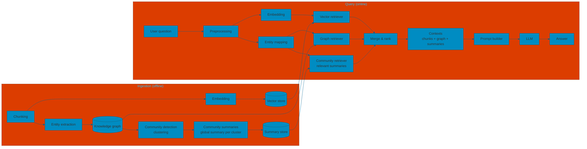

We add a **community** layer: the graph is clustered into communities (e.g. by connectivity), each community gets a **global summary** (LLM or aggregation). At query time, we can retrieve not only chunks and entity neighborhoods but also **community summaries** for high-level context.

