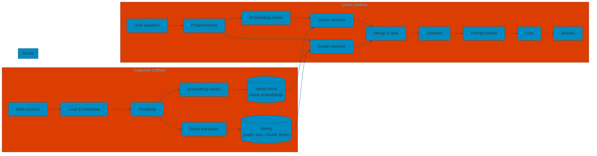
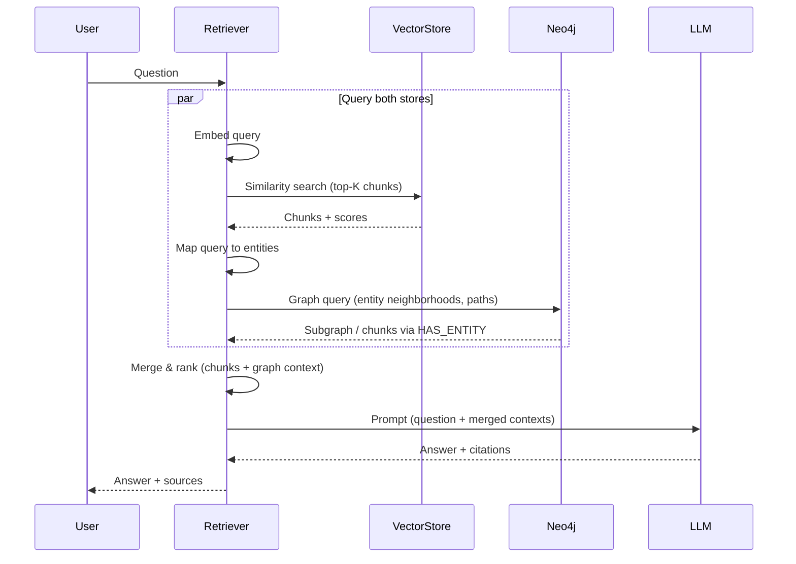

# Dual-store architecture (Neo4j + vector store)

Alternative to a unified graph: **two separate bases** — **Neo4j** for the knowledge graph (Document, Chunk, Entity, relations) and a **vector store** for chunk embeddings. Ingestion writes to both; retrieval queries both and merges results before the LLM.

---

## Architecture overview

- **Vector store**: chunk text + embeddings; no graph. Use for similarity search (e.g. top-K chunks by embedding).
- **Neo4j**: Document, Chunk, Entity nodes and PART_OF, NEXT, HAS_ENTITY, RELATES_TO. Use for entity resolution, neighborhood expansion, and structural queries.
- **Ingestion**: chunking and embedding → vector store; chunking + entity extraction → Neo4j (with chunk–entity links). Chunk identifiers can be shared so the retriever can join results (e.g. same chunk from vector search and from graph).
- **Retrieval**: run vector search and graph queries (optionally in parallel), then merge and rank before building the prompt.

---

## Retrieval flow (dual-store)

At query time the **retriever** calls **both** the vector store and Neo4j, then merges the results and sends a single context to the LLM.

- **Vector store**: returns top-K chunks by semantic similarity; no graph.
- **Neo4j**: returns entity neighborhoods (and optionally chunks linked via HAS_ENTITY) for the resolved query entities.
- **Merge**: deduplicate by chunk ID if the same chunk comes from both stores; rank by score and relevance; then build one context string for the LLM.
- **LLM**: receives a single prompt (question + merged contexts) and returns the answer; the retriever adds sources (chunk/doc references).

This flow keeps graph and vectors separate while still supporting hybrid retrieval (lexical + structural) and a single answer path through the LLM.
