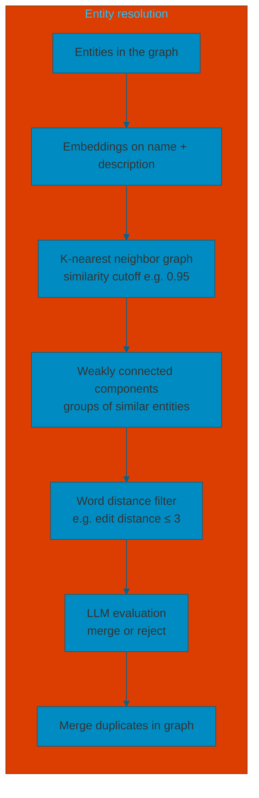

# Entity resolution

**Entity resolution** (de-duplication) ensures that each real-world entity is represented once in the knowledge graph. The same entity often appears under slightly different names across documents (e.g. *Silicon Valley Bank* vs *Silicon_Valley_Bank*, *Sinn Fein* vs *Sinn Féin*). Without resolution, the graph stays fragmented, sparse, and inconsistent; with it, data from multiple sources is consolidated into a unified view and retrieval becomes more reliable.

---

## Classic Entity Resolution (ER) techniques

Before diving into the pipeline used in this doc, here is a short overview of common ER families:

1. **Deterministic rules and normalization**  
   Normalization (case, accents, punctuation, stopwords); exact or near-exact keys (VAT/SIREN, email, business ID); rules of the form “if same (X, Y, Z) ⇒ match”.  
   → Very precise; often the best first pass.

2. **Fuzzy matching (strings)**  
   Jaro–Winkler, Levenshtein; n-grams / TF-IDF; phonetic (Soundex, Metaphone).  
   → Very useful for organization, person, and address names.

3. **Probabilistic record linkage (e.g. Fellegi–Sunter)**  
   Compute a match probability from several fields; handles missing or noisy fields well.

4. **Supervised ML (pairwise classification)**  
   Train a model on “match / non-match” pairs; features = similarities (name, address, dates, etc.).  
   → Strong in production if you can label a minimum of pairs.

5. **Embeddings + ANN / kNN (vector similarity)**  
   Encode a “representation” (name + attributes + context); use nearest neighbors to find candidates.  
   → Very effective when data is heterogeneous, multilingual, or noisy.

6. **Collective ER (graph-based)**  
   Use the graph to reinforce a decision (e.g. “same company if same subsidiaries + same site + same products”); propagation, constraints, global consistency.  
   → Very relevant in Graph RAG, since you already have a relational graph.

---

The approach below (inspired by the [Neo4j/LangChain “constructing the graph” post](https://medium.com/neo4j/implementing-from-local-to-global-graphrag-with-neo4j-and-langchain-constructing-the-graph-73924cc5bab4)) combines several of these ideas—**text embeddings**, **graph algorithms** (k-nearest neighbor, weakly connected components), **word-distance filtering**, and an **LLM**—into a concrete pipeline.

## Pipeline overview

---

## Step-by-step

### 1. Entities in the graph

Start with **all entities** already in the knowledge graph (extracted from chunks). Each entity has at least an identifier (e.g. `id`) and optionally a `description`. The goal is to find groups of nodes that refer to the same real-world entity and merge them.

### 2. K-nearest neighbor graph

- Compute **text embeddings** for each entity (e.g. on `id` + `description`) and store them on the node (e.g. `embedding` property).
- Build a **k-nearest neighbor (KNN) graph** over these embeddings: connect each entity to its top-K most similar entities (e.g. cosine similarity). Use a **similarity cutoff** (e.g. 0.95) so that only highly similar pairs get a link.
- In Neo4j with GDS: project the entity graph with `nodeProperties: ["embedding"]`, then run the KNN algorithm in **mutate** mode to add a new relationship type (e.g. `SIMILAR`) and a `score` property. This yields a graph of “candidate duplicate” pairs.

**Note:** KNN here is used in a **different way** from typical vector search (e.g. “find top-K similar chunks for a query”). Here the goal is to **link existing graph nodes to each other** by similarity and then run graph algorithms (WCC, filters, LLM) on those links. **Neo4j GDS** is well suited for this: it runs KNN over node properties in the graph and writes `SIMILAR` edges directly, so you stay in one store and can chain WCC and other algorithms without moving data to a separate vector database. For this entity-resolution workflow, GDS is often more appropriate than a dedicated vector store.

High embedding similarity alone is not enough (e.g. “Google” and “Apple” can be close); the next steps refine the candidates.

### 3. Weakly connected components + word distance filter

- Run **Weakly Connected Components (WCC)** on the KNN graph (on the `SIMILAR` relationships). Each component is a set of entities that are transitively similar by embedding.
- Apply a **word-distance filter** on each component: keep only entity pairs whose **string distance** is below a threshold (e.g. Levenshtein/edit distance ≤ 3, or one string contains the other). This filters out pairs like “Google”/“Apple” or “March 2016”/“March 2020” that are embedding-similar but not the same entity.
- The output is **groups of candidate duplicates** (e.g. `['Sinn Fein', 'Sinn Féin']`, `['Unreal Engine', 'Unreal_Engine']`). Some groups will be false positives and need a final check.

### 4. LLM evaluation and merge

- For each group of candidate duplicates, call an **LLM** with a prompt that lists the entity names (and optionally descriptions) and asks: *Should these be merged into one entity?* (e.g. yes for “Silicon Valley Bank” and “Silicon_Valley_Bank”, no for “September 16, 2023” and “September 2, 2023”).
- Use the LLM’s decision to **merge** the chosen nodes in the graph: collapse duplicates into a single canonical node and redirect relationships so that the graph stays consistent.

---

## Parameters and trade-offs

| Parameter | Role | Trade-off |
|-----------|------|-----------|
| **Similarity cutoff** (e.g. 0.95) | Min. cosine similarity to add a SIMILAR edge. | Higher → fewer false positives, risk of missing true duplicates (e.g. different spellings). |
| **topK** | Number of nearest neighbors per node. | Larger → more candidates, noisier. |
| **Word distance** (e.g. edit distance ≤ 3) | Filter on string similarity after WCC. | Stricter → fewer wrong merges (e.g. dates); can reject valid variants (e.g. “Asia Pacific” / “Asia-Pacific”). |
| **LLM** | Final merge decision per group. | Handles nuance (e.g. “New York Jets” vs “New York Mets”); adds cost and latency. |

With **predefined node types** (e.g. Person, Organization), you can use type-specific heuristics and prompts; without them, resolution is harder and the combination of embeddings + graph algorithms + word distance + LLM is a practical default.
