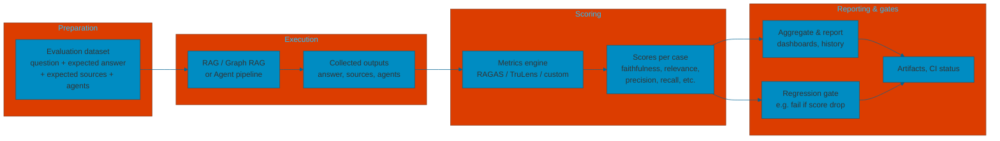

# Quality evaluation — Overview

Evaluating a RAG or Graph RAG system means measuring how well answers, retrieval, and (optionally) agent behaviour match what you expect. This page outlines **what impacts quality**, **evaluation criteria**, **scoring and metrics**, **libraries** to compute them, and a **pipeline** to industrialize tests.

---

## What impacts quality

Final answer quality is influenced by **the whole pipeline**, not only the LLM. It’s common to think of the model first, but ingestion, retrieval, and context assembly matter just as much. Below are the main levers.

| Area | Impact |
|------|--------|
| **LLM** | Model choice, temperature, system prompt, and response format. The most visible lever, but only one of many. |
| **Chunking** | Chunk size and strategy (fixed size, semantic, section-based). Too small → fragmented context; too large → noise and lost precision. |
| **Entity recognition** | What entities and relations are extracted (NER/LLM, schema). Missing or wrong entities weaken the graph and retrieval. |
| **Entity resolution** | Deduplication of entities. Duplicates fragment the graph and dilute relevance; good resolution improves consistency. |
| **Entity linker** | Linking extracted entities to a knowledge base or canonical IDs. Errors here propagate to retrieval and answers. |
| **Embedding model** | Choice and tuning of the embedding model. Drives vector search quality and thus which chunks or entities are retrieved. |
| **Retrieval strategy** | Top-k, thresholds, hybrid (vector + keyword), use of graph (local/global). Determines how much and how relevant the context is. |
| **Context builder** | How retrieved chunks, graph neighbourhoods, and summaries are ordered, trimmed, and formatted for the prompt. Affects what the LLM “sees”. |
| **Community summarization** | In hierarchical Graph RAG, quality of community summaries influences global retrieval and high-level answers. |

When quality drops, check **retrieval and context** (did the right sources get into the prompt?) and **ingestion** (chunking, entities, resolution, linking) before assuming the LLM is at fault. Evaluation criteria and metrics below help you pinpoint which stage is failing.

---

## Evaluation criteria

A single evaluation case is typically described by:

| Criterion | Description |
|----------|-------------|
| **Question** | The user query (or instruction) used as input to the system. |
| **Expected answer** | The reference answer (ground truth) against which the system’s output is compared. Can be a full text, key facts, or a structured checklist. |
| **Expected sources used** | The set of documents, chunks, or graph nodes/edges that *should* be retrieved or used to produce the answer. Used to measure retrieval quality (e.g. context precision/recall). |
| **Expected agents used** | When the system uses agents or tools (e.g. “search”, “graph query”, “calculator”), which agents or tools were *expected* to be invoked for this question. Optional; relevant for agentic or multi-step pipelines. |

From these you can derive **inputs** (question) and **targets** (answer, sources, agents) and then run the system, collect its outputs, and score them with the metrics below.

---

## Scoring and metrics

Scoring compares **system outputs** (answer, retrieved sources, agents used) to the **expected** ones. Common metric families:

| Metric family | What it measures | Typical use |
|---------------|------------------|-------------|
| **Faithfulness / factual consistency** | Does the answer stay consistent with the retrieved context (no hallucination)? | Compare model answer to context; often LLM- or NLI-based. |
| **Answer relevance** | Does the answer address the question? | Compare question vs answer (semantic similarity or LLM judge). |
| **Context precision / recall** | Are the *right* sources retrieved? Precision: among retrieved items, how many are relevant. Recall: among relevant items, how many were retrieved. | Compare retrieved IDs (or content) to expected sources. |
| **Answer correctness / match** | Overlap or semantic similarity between generated answer and expected answer. | Exact match, F1 over tokens, or embedding similarity. |
| **Agent / tool usage** | Did the system call the expected agents or tools? | Compare list of invoked agents/tools to expected list. |

Metrics can be **automated** (e.g. similarity scores, LLM-as-judge) or **human** (expert rating). For industrialization, automated metrics are run on every test case; human review can sample or escalate edge cases.

---

## Libraries and tools

Common libraries and platforms for RAG / agent evaluation:

| Tool | Focus | Notes |
|------|--------|------|
| **RAGAS** | RAG evaluation (faithfulness, answer relevance, context precision/recall) | Open source; uses LLM or NLI for faithfulness; needs question, answer, context, ground truth. |
| **TruLens** | RAG and LLM apps (feedback functions, metrics, tracing) | Modular “feedback” functions; integrates with LangChain, LlamaIndex; can track context and relevance. |
| **LangSmith** | Observability and evaluation for LangChain apps | Trace runs, datasets, human feedback, automated metrics; good for regression and A/B tests. |
| **LlamaIndex Evaluation** | Evaluation module for LlamaIndex pipelines | Built-in metrics (faithfulness, relevance, etc.) and integration with RAGAS or custom scorers. |
| **BLEU / ROUGE / BERTScore** | Text similarity (answer vs reference) | Classic NLP metrics; useful as one signal among others, not sufficient alone for RAG. |

Choose according to your stack (LangChain, LlamaIndex, custom) and whether you need only offline metrics or also tracing and human-in-the-loop.

---

## Pipeline for industrializing tests

To run evaluation in a repeatable way (CI, regression, releases), use a clear pipeline: **dataset → run system → compute metrics → store results and optionally fail on regressions**.

- **Preparation**: Maintain an evaluation dataset (e.g. CSV or JSON) with one row per case: question, expected answer, expected source IDs or snippets, and optionally expected agents. Version it with the code.
- **Execution**: For each case, run the full pipeline (retrieval + generation, and agents if applicable); record the actual answer, retrieved sources, and agents used.
- **Scoring**: Feed outputs and expectations into a metrics engine (e.g. RAGAS, TruLens, or your own functions) to get per-case and aggregate scores.
- **Reporting & gates**: Persist results (e.g. in CI artifacts or a DB), expose dashboards or reports, and optionally add a **regression gate** (e.g. fail the build if average faithfulness or recall drops below a threshold compared to a baseline).

This pipeline can be run on every PR or nightly to keep quality under control as you change retrieval, prompts, or graph structure.
